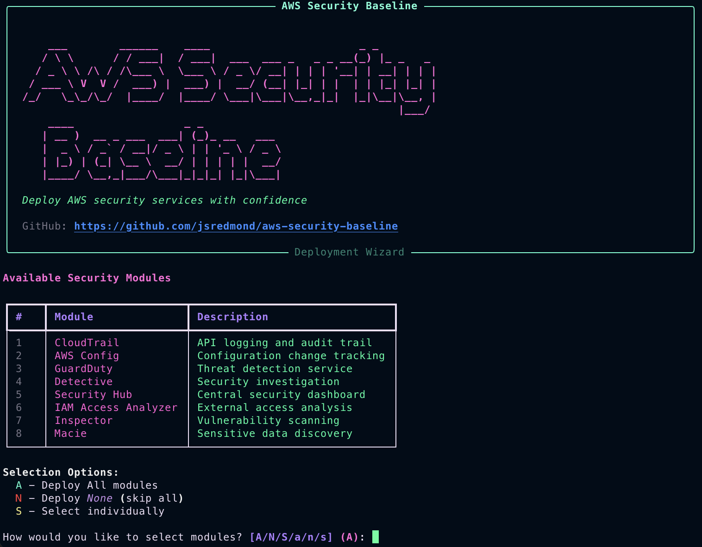

<p align="center">
  <h1 align="center">🛡️ AWS Security Baseline</h1>
  <p align="center">
    <strong>Terraform modules to bootstrap security best practices in AWS environments</strong>
  </p>
</p>

<p align="center">
  <a href="https://github.com/jsredmond/aws-security-baseline/actions/workflows/super-linter.yml">
    
  </a>
  <a href="LICENSE">
    
  </a>
  <a href="https://www.terraform.io/">
    
  </a>
  <a href="https://registry.terraform.io/providers/hashicorp/aws/latest">
    
  </a>
</p>

<hr>

## 📋 Overview

AWS Security Baseline provides a modular, production-ready Terraform implementation for deploying core AWS security services. Each service is encapsulated in its own reusable module, making it easy to maintain, test, and customize.

### Security Services

| Service             | Description                                 | Module                                             |
| ------------------- | ------------------------------------------- | -------------------------------------------------- |
| **CloudTrail**      | Centralized API logging with KMS encryption | [modules/cloudtrail](./modules/cloudtrail)         |
| **AWS Config**      | Configuration change tracking & compliance  | [modules/config](./modules/config)                 |
| **GuardDuty**       | Intelligent threat detection                | [modules/guardduty](./modules/guardduty)           |
| **Detective**       | Visual security investigation               | [modules/detective](./modules/detective)           |
| **Security Hub**    | Central security findings dashboard         | [modules/securityhub](./modules/securityhub)       |
| **Access Analyzer** | IAM policy & resource access analysis       | [modules/accessanalyzer](./modules/accessanalyzer) |
| **Inspector**       | Automated vulnerability scanning            | [modules/inspector](./modules/inspector)           |
| **Macie**           | Sensitive data discovery                    | [modules/macie](./modules/macie)                   |

<hr>

## 🚀 Quick Start

### Prerequisites

- [Terraform](https://www.terraform.io/downloads.html) >= 1.14.0
- AWS CLI configured with appropriate credentials
- AWS account with permissions for security services

### Installation

```bash
# Clone the repository
git clone https://github.com/jsredmond/aws-security-baseline.git
cd aws-security-baseline

# Initialize Terraform
terraform init

# Review the execution plan
terraform plan

# Deploy
terraform apply
```

<hr>

## 🧙 Deployment Wizard

An interactive CLI wizard is included to simplify configuration. The wizard guides you through selecting services, configuring regions, and generating `terraform.tfvars` files.

<p align="center">
  
</p>

### Running the Wizard

```bash
# Install dependencies
python3 -m venv wizard/.venv
source wizard/.venv/bin/activate
pip install -r wizard/requirements.txt

# Run the wizard
python wizard.py
```

### Non-Interactive Mode

```bash
# Enable all modules with custom settings
python wizard.py --all-modules --region us-west-2 --env production

# Add custom tags
python wizard.py --all-modules --tag Project=Security --tag Team=DevOps
```

See [wizard/README.md](./wizard/README.md) for full documentation.

<hr>

## ⚙️ Configuration

### Basic Configuration

Create a `terraform.tfvars` file:

```hcl
environment = "prod"
aws_region  = "us-east-1"

# Enable/disable services
enable_cloudtrail   = true
enable_config       = true
enable_guardduty    = true
enable_detective    = true
enable_securityhub  = true

# Common tags
common_tags = {
  Project     = "SecurityBaseline"
  ManagedBy   = "Terraform"
}
```

### Input Variables

| Variable             | Description                         | Type   | Default      |
| -------------------- | ----------------------------------- | ------ | ------------ |
| `environment`        | Environment name (dev/staging/prod) | string | **required** |
| `aws_region`         | AWS region for deployment           | string | `us-east-1`  |
| `enable_cloudtrail`  | Enable CloudTrail module            | bool   | `true`       |
| `enable_config`      | Enable AWS Config module            | bool   | `true`       |
| `enable_guardduty`   | Enable GuardDuty module             | bool   | `true`       |
| `enable_detective`   | Enable Detective module             | bool   | `true`       |
| `enable_securityhub` | Enable Security Hub module          | bool   | `true`       |
| `common_tags`        | Common tags for all resources       | map    | `{}`         |

<hr>

## 🏗️ Architecture

```
.
├── main.tf              # Root module - orchestrates all services
├── backend.tf           # Remote state configuration (S3 + DynamoDB)
├── providers.tf         # AWS provider configuration
├── variables.tf         # Root-level input variables
├── outputs.tf           # Aggregated outputs from modules
├── versions.tf          # Terraform and provider version constraints
├── wizard/              # Deployment wizard CLI
│   ├── cli.py
│   ├── display.py
│   ├── generator.py
│   └── ...
└── modules/             # Reusable service modules
    ├── accessanalyzer/
    ├── cloudtrail/
    ├── config/
    ├── detective/
    ├── guardduty/
    ├── inspector/
    ├── macie/
    └── securityhub/
```

<hr>

## 🔧 Remote State

For team collaboration, configure S3 backend with DynamoDB locking:

```hcl
# backend.tf
terraform {
  backend "s3" {
    bucket         = "your-terraform-state-bucket"
    key            = "security-baseline/terraform.tfstate"
    region         = "us-east-1"
    encrypt        = true
    dynamodb_table = "terraform-state-lock"
  }
}
```

See [DEPLOYMENT_TEST.md](./DEPLOYMENT_TEST.md) for detailed backend setup instructions.

<hr>

## 🧪 Security & Testing

### CI/CD Pipeline

| Tool             | Purpose                                            |
| ---------------- | -------------------------------------------------- |
| **Super-Linter** | Multi-language linting (Terraform, YAML, Markdown) |
| **Checkov**      | Infrastructure security scanning                   |
| **TFLint**       | Terraform-specific linting                         |
| **Dependabot**   | Dependency vulnerability scanning                  |

### Local Testing

```bash
# Format Terraform files
terraform fmt -recursive

# Validate configuration
terraform validate

# Run security scan (REQUIRED before commits)
checkov -d . --framework terraform

# Run linter
tflint --recursive
```

<hr>

## 🔐 Security Features

- **Encryption**: All data at rest encrypted with KMS (key rotation enabled)
- **Access Control**: S3 buckets block public access
- **Logging**: Comprehensive audit logging via CloudTrail
- **Compliance**: Security Hub integrates CIS and AWS Foundational standards
- **Organization Support**: GuardDuty auto-enrollment for organization accounts

<hr>

## 📖 Documentation

- [Deployment Testing Guide](./DEPLOYMENT_TEST.md)
- [Wizard Documentation](./wizard/README.md)
- [Security Policy](./SECURITY.md)

### Module Documentation

Each module includes its own README with usage examples:

- [CloudTrail Module](./modules/cloudtrail/README.md)
- [Config Module](./modules/config/README.md)
- [GuardDuty Module](./modules/guardduty/README.md)
- [Detective Module](./modules/detective/README.md)
- [Security Hub Module](./modules/securityhub/README.md)
- [Access Analyzer Module](./modules/accessanalyzer/README.md)
- [Inspector Module](./modules/inspector/README.md)
- [Macie Module](./modules/macie/README.md)

<hr>

## 🛠️ Contributing

1. Fork the repository
2. Create a feature branch: `git checkout -b feature/your-feature`
3. Run tests: `terraform validate && checkov -d .`
4. Commit with conventional commits: `git commit -m "feat(module): description"`
5. Push and open a Pull Request

<hr>

## 📄 License

This project is licensed under the MIT License - see the [LICENSE](LICENSE) file for details.

<hr>

## 👤 Author

Maintained by [Jeremy Redmond](https://github.com/jsredmond)

<hr>

<p align="center">
  <strong>⭐ Star this repo if you find it useful!</strong>
</p>
